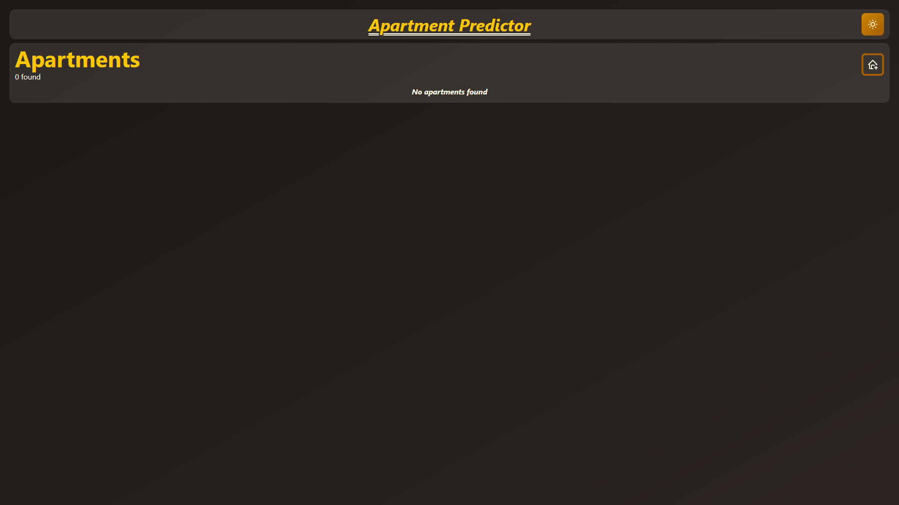
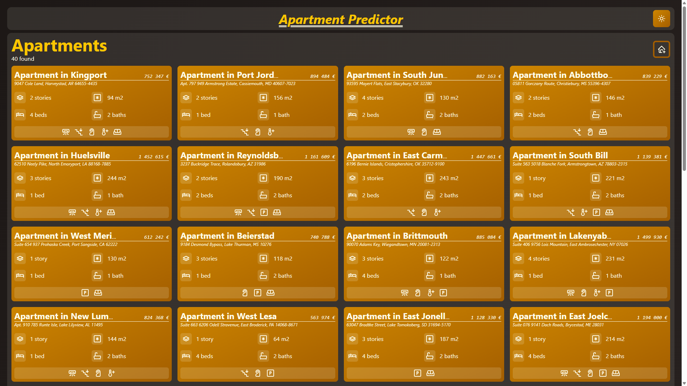
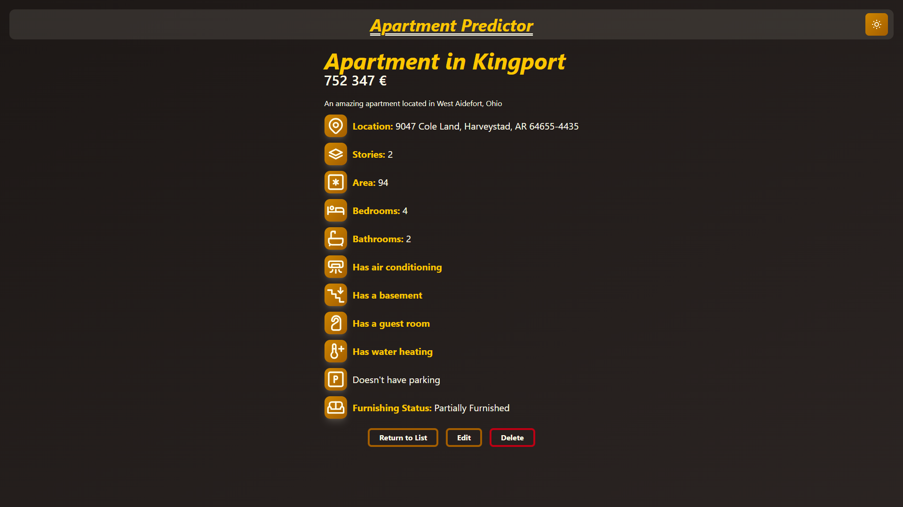
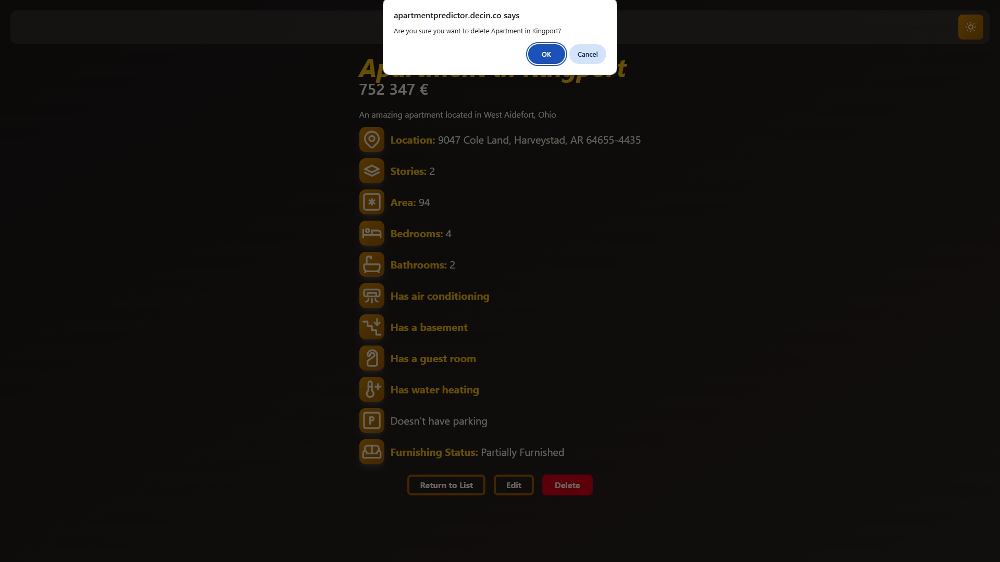
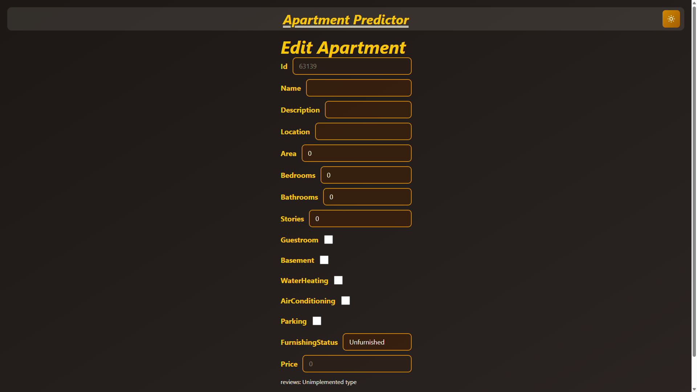
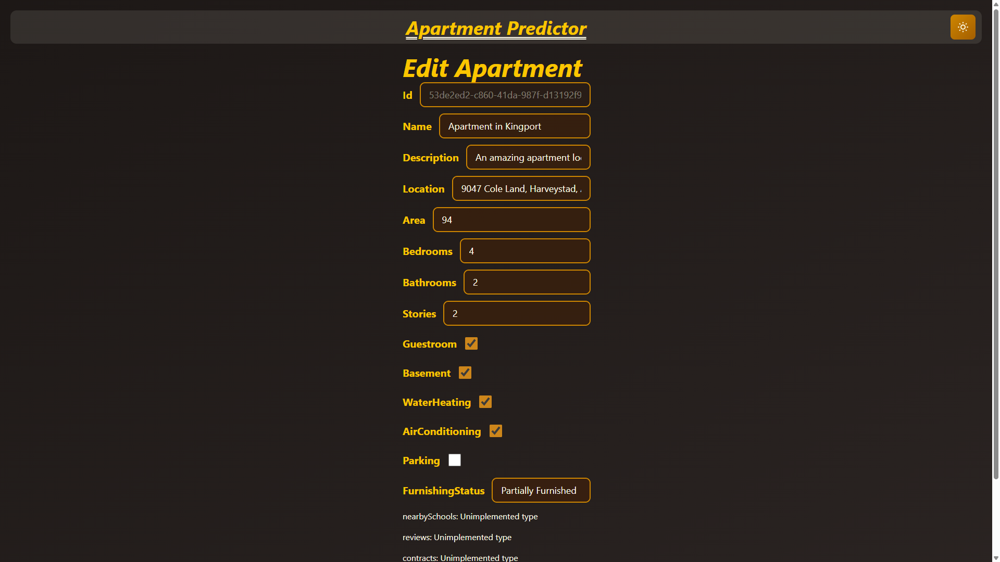
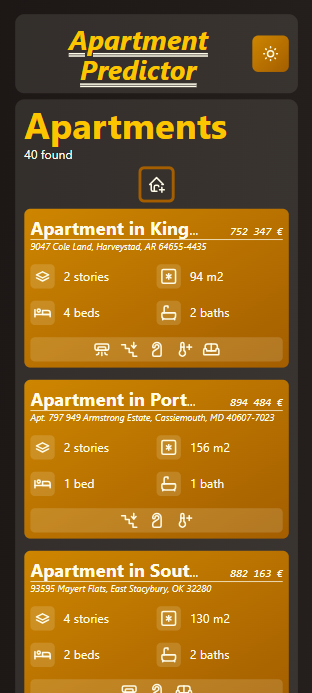
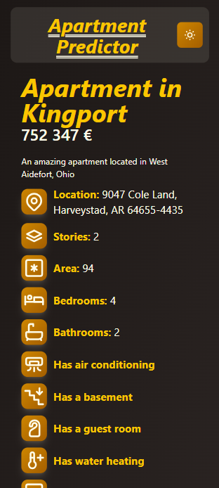
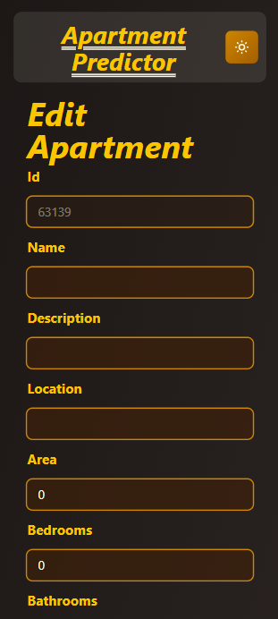

# Apartment Predictor Technical Documentation

## Technologies

- Language: Typescript
- Build Tool: Vite
- Interface: React
- Visual Design: TailwindCSS
- Icons: [Tabler Icons](https://tabler.io/icons)
- API Consumption: Axios

## UI Functions

This frontend has three different functions, and to change between them, it has a main component that can store strings corresponding to each of them in state and conditionally renders the relevant UI based on its current value.

The functions are as follows:

### Listing Apartments

Shows a list of all the apartments and their properties in a grid. Icons are used here to represent features the apartment has in a shorter way. If there aren't any apartments, it will inform the user.




Apartments can be clicked on to show their info, and the "Create New" button can be pressed to create a new apartment.

### Viewing an Apartment

Shows more information about an apartment, and explains to the user what the icons in the previous page mean.



From here, the apartment can be edited or deleted, and the user can return to the list. If the user wants to delete an aparment, they will be prompted before doing so.



### Editing or Creating an Apartment

Allows the user to create or edit an apartment, depending on where they come from. If they come from the list, the UI will autogenerate an ID and pre-fill the form with default values. In this state, when pressing "Cancel", the user returns to the list.



If the user instead comes from an apartment's details page, the UI will pre-fill the form with the selected apartment's values. In this state, when pressing "Cancel", the user returns to the details page.



In both cases, after submitting the form, the user returns to the details page.

## Responsiveness

This application's UI is responsive to small and medium screens. Here are some screenshots of what the UI looks like:





The UI is also responsive to hovering and focusing events.

## Data

Data is obtained from the Spring Boot API hosted at decin.co. This application uses the following structure to parse the data fetched from the api:

```ts
export const FurnishingStatus = {
    UNFURNISHED: 'Unfurnished',
    PARTIALLY_FURNISHED: 'Partially Furnished',
    FULLY_FURNISHED: 'Fully Furnished',
} as const

export type FurnishingStatusType = typeof FurnishingStatus[keyof typeof FurnishingStatus]

export interface Apartment {
    id: string
    name: string
    price: number
    area: number
    bedrooms: number
    bathrooms: number
    stories: number
    guestroom?: boolean
    basement?: boolean
    hotwaterheating?: boolean
    airconditioning?: boolean
    parking?: boolean
    furnishingstatus: FurnishingStatusType
}
```

## Issues & Todos

During development, my biggest issue was finding a structure for the program that *made sense*. After realizing that the first structure wasn't gonna cut it, and that some of the features of the application were severely overengineered, I looked for a way to restructure and simplify the program, assisted by AI tools. As the first way I was coding slowed me down, I had to rush the other features, which left the application with some todos.

- **More scalable UI Elements**: Currently, the UI's styles and icons are hardcoded, which makes it harder to scale the app.
- **Reviews**: Apartments can have reviews, that could be shown and edited through the View page. Neither ends have this feature.
- **UI animations**: The UI could use with some animations.
